# Neural Network from Scratch: Digit Recognition
A fast and cool MLP from scratch in Python that classifies handwritten digits from the [MNIST dataset](#mnist-dataset).

#### UPDATE 7/11/23:
Added parallelization with batches => now trains **x17** faster! :D

#### Screenshots
 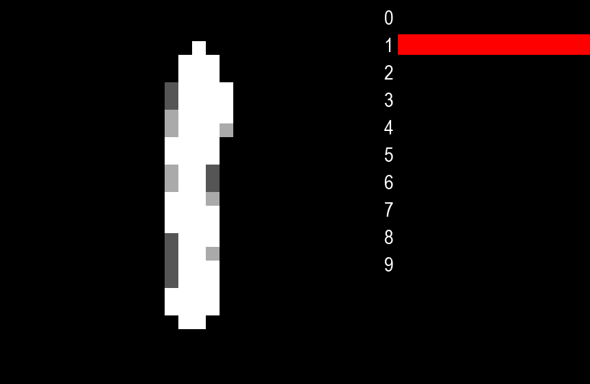 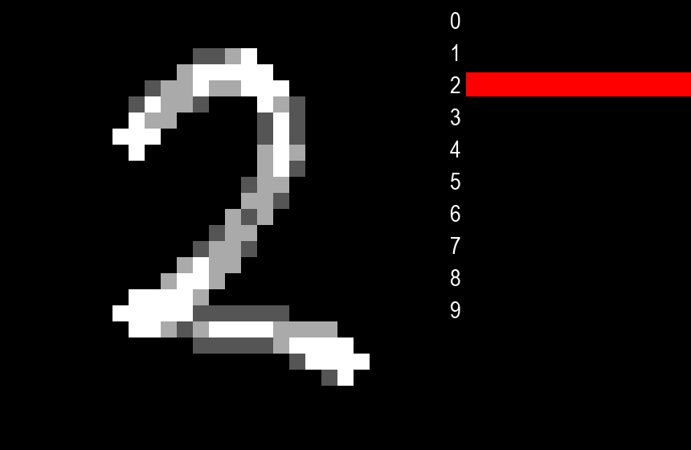 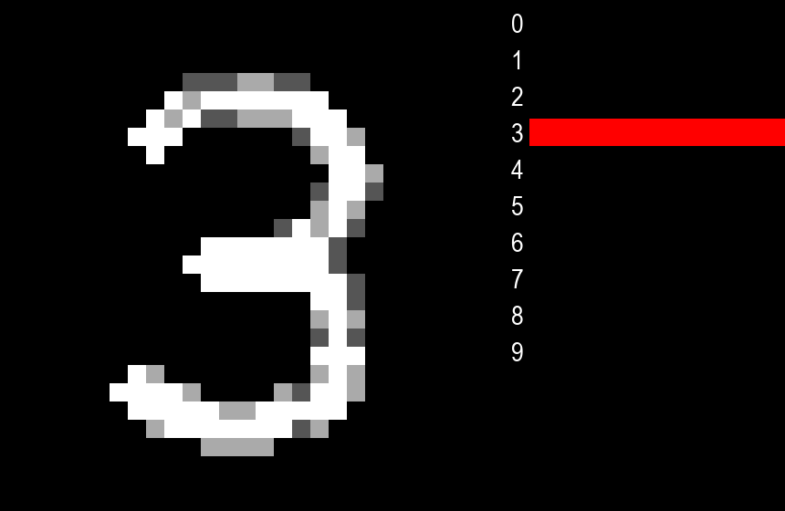

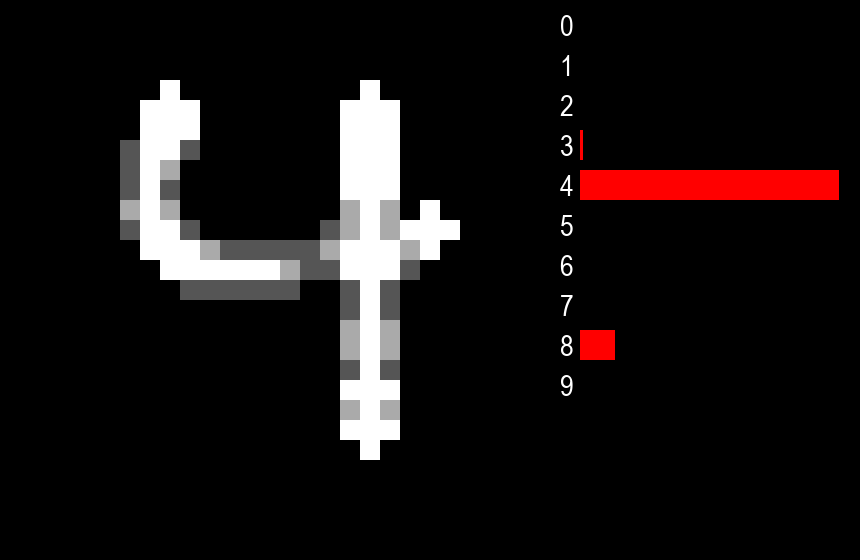 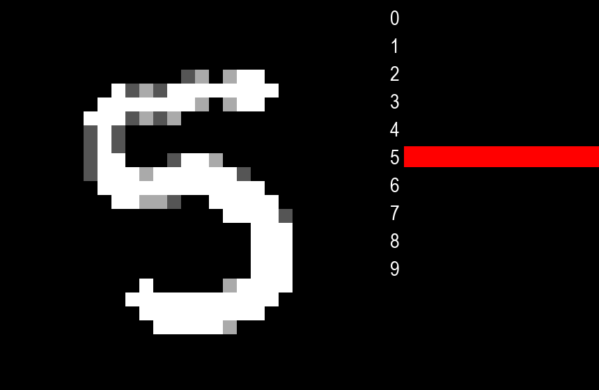 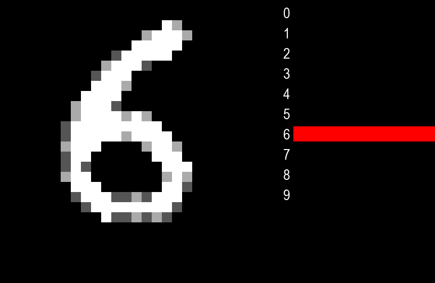 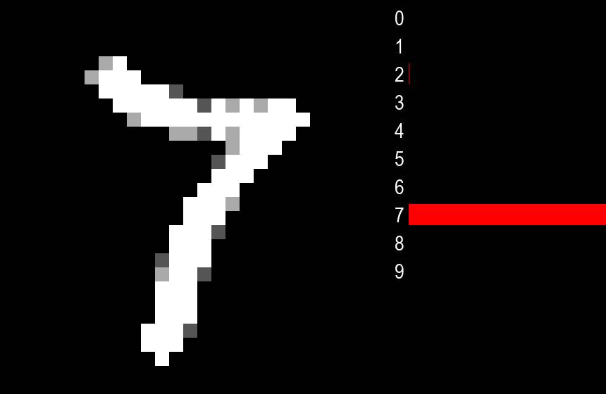

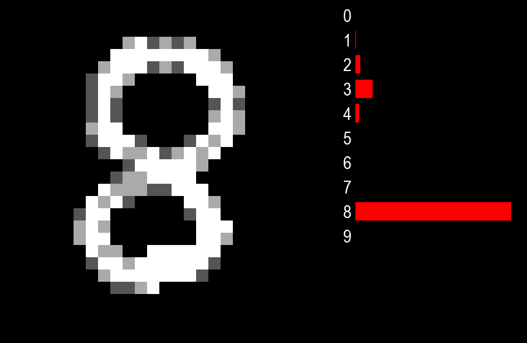 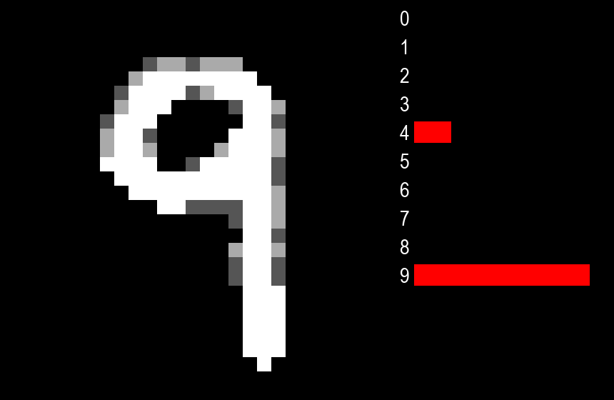 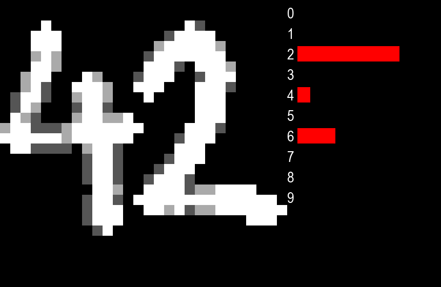

## Table of Contents
1. [MNIST dataset](#mnist-dataset)
2. [Neural Network Architecture](#neural-network-architecture)
3. [Forward propagation](#forward-propagation)
4. [Loss Function: Cross-entropy](#loss-function-cross-entropy)
5. [Learning and Optimization: Gradient Descent](#learning-and-optimization-gradient-descent)
6. [Real-Time Digit Recognition](#real-time-digit-recognition)
7. [Scratch vs. TensorFlow](#scratch-vs-tensorflow)

#### Cross-entropy loss function
$$J(p,q) = -\sum_{x}p(x)log(q(x))$$
[Why cross-entropy?](#loss-function-cross-entropy)

#### Gradient descent as optimization algorithm
$$w = w - \alpha \frac{\partial L}{\partial w}$$
$$b = b - \alpha \frac{\partial L}{\partial b}$$
[Why gradient descent?](#learning-and-optimization-gradient-descent)

## MNIST dataset
The [MNIST dataset](https://en.wikipedia.org/wiki/MNIST_database) consists of 70,000 images of handwritten digits (0-9) represented as a 784-vector of pixel values (28x28=784) ranging from 0 to 255.

#### Preprocessing
The data is normalized as pixel_value / 255.

#### Split
- 80% for training
- 10% for validation
- 10% for testing

## Neural Network Architecture
#### Input layer
- 784 neurons, one for each pixel.
#### Hidden layers
- Two hidden layers with 50 and 25 neurons respectively.
- Both use [ReLU](https://en.wikipedia.org/wiki/Rectifier_(neural_networks)) activation.
#### Output layer
- 10 neurons with linear activation (one for each digit).
- And finally [softmax](https://en.wikipedia.org/wiki/Softmax_function) to get the probabilities of each digit.

#### Parameters
- 784 * 50 + 50 * 25 + 25 * 10 = 40700 weights.
- 50 + 25 + 10 = 85 biases.
- Total: 40785 parameters.

ReLU and Softmax implementation in Python:
```python
def relu(X):
    return np.where(X > 0, X, 0)

def softmax(logits):
    exp_logits = np.exp(logits)
    return exp_logits / np.sum(exp_logits, axis=1, keepdims=True)
```

#### Hiperparameters
- Epochs: 20
- Batch Size: 64
- Learning Rate: Fixed at 0.01. While more advanced algorithms like [Adam](https://optimization.cbe.cornell.edu/index.php?title=Adam) could be considered, a learning rate of 0.01 achieves an accuracy of approximately 98%, which is enough for practical purposes.
- Weight Initialization: [He initialization](https://machinelearningmastery.com/weight-initialization-for-deep-learning-neural-networks/) for weights.

#### After 20 epochs, the loss functions doesn't change much:
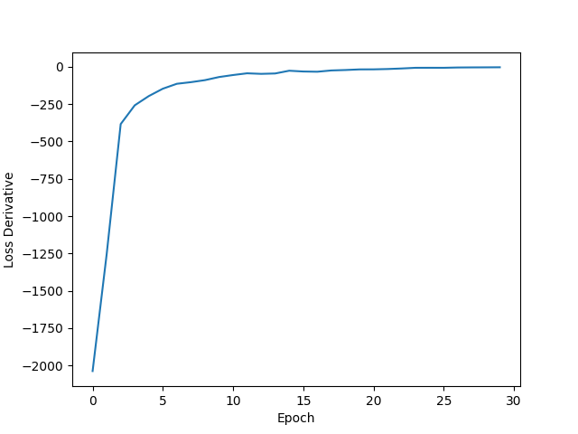

#### Model implementation in Python:
```python
layers = [784, 50, 25, 10]
model = NN(layers)

# Train
model.fit(
    X_train,
    y_train,
    epochs=10,
    learning_rate=0.01,
    batch_size=64,
)

# Evaluate
evaluate(model, X_train, y_train, "Train")
evaluate(model, X_val, y_val, "Validation")
```
[nn_scratch.py](nn_scratch.py)

## Forward propagation
The `predict(X)` function performs the forward propagation as follows:

```python
def predict(self, X):
    batch_size = X.shape[0]
    Z = [np.zeros((batch_size, c)) for c in self.layers]

    # Input layer
    Z[0] = X

    # Hidden layers
    for i in range(len(self.layers) - 2):  # 0, 1
        Z[i + 1] = relu(Z[i] @ self.W[i] + self.B[i])

    # Output layer
    Z[3] = Z[2] @ self.W[2] + self.B[2]

    return Z, softmax(Z[3])
```

#### Explanation
1. **Input Layer**:
    - Set the input layer activations as `X`.
2. **Hidden Layers**:
    - For each hidden layer:
        - For each hidden neuron:
            - This neuron relies on all previous layer neurons * its mutual weights: n1w1 + n2w2 + ... + nNwN, and thats literally the definition of dot product: `Z[i] @ W[i]`
            - Add the bias: `+ B[i]`
            - Use `relu()` as the activation function.
            - It's done!
3. **Output Layer**:
    - Similar to the hidden layers but with linear activation.
    - Apply `softmax()` to get the probabilities of each digit.

## Loss Function: Cross-entropy
Being the generalization of the well-known [log-loss](https://en.wikipedia.org/wiki/Cross_entropy#Cross-entropy_loss_function_and_logistic_regression) function for binary classification, cross-entropy is a natural choice for multi-class classification problem.

For each training example:
- `y_pred` is the ouput of the nn, a 10-vector containing the probabilities of each digit.
- `y_true` is the true label one hot encoded.

It works as follows:
```python
# Loss, with batch_size=64 and layers[-1]=10
y_true = np.zeros((batch_size, self.layers[-1]))  # (64, 10)
y_true[np.arange(batch_size), y_batch] = 1  # label one hot encoded
epoch_loss += cross_entropy(y_true, y_pred) / batch_size
```
One hot encoded means that for example if the label is $4$, then `y_true` will be `[0, 0, 0, 0, 1, 0, 0, 0, 0, 0]`.

Where `cross_entropy` is defined as:
```python
def cross_entropy(y_true, y_pred):
    return -np.sum(y_true * np.log(y_pred + 1e-8))  # 1e-8 to avoid ln(0)
```

`np.log(y_pred)` will always return negative values because `y_pred` will always be between `0` and `1`, and `ln(x)` is negative for `0 < x < 1`.

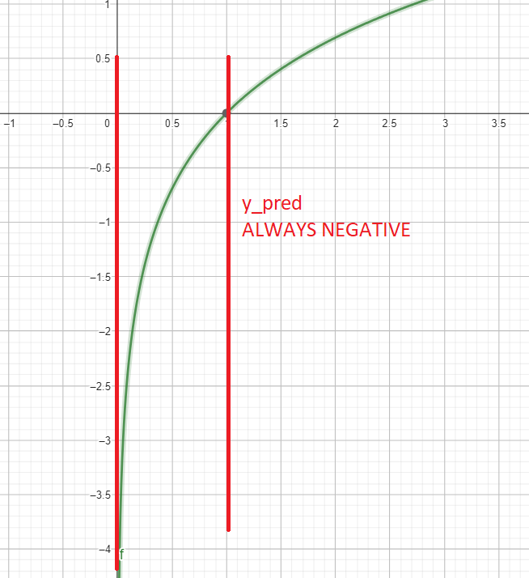

So `np.sum()` must be multiply by `-1` to get the loss as positive.

#### Loss function over epochs
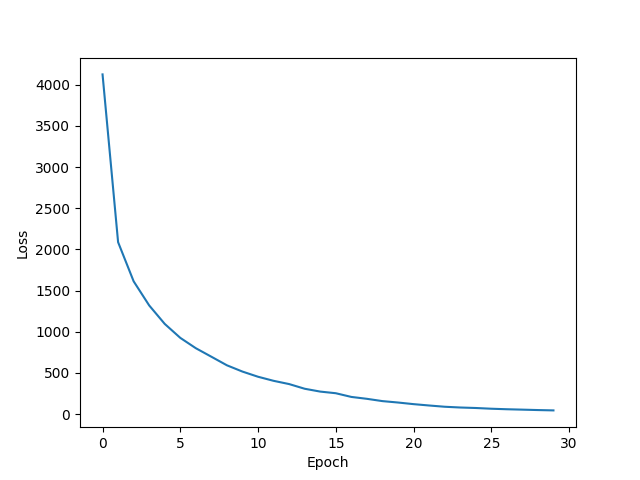

## Learning and Optimization: Gradient Descent
Neural netorks learns by iteratively adjusting it's weights and biases to minimize the loss function. This is done by calculating the partial derivatives of the loss function with respect to the weights and biases, and then updating the weights and biases in the opposite direction of the gradient.

#### Gradient descent
$$w = w - \alpha \frac{\partial L}{\partial w}$$
$$b = b - \alpha \frac{\partial L}{\partial b}$$

Where $\alpha$ is the learning rate.

#### How much does the loss function change when we change the weights and biases?

Using the chain rule:
$$\frac{\partial L}{\partial w} = \frac{\partial L}{\partial z} \frac{\partial z}{\partial w}$$
$$\frac{\partial L}{\partial b} = \frac{\partial L}{\partial z} \frac{\partial z}{\partial b}$$

Where $z$ is the output of a neuron.

#### Implementation in Python:
```python
def backprop(self, Z, y_true, y_pred):
    dZ = [np.zeros_like(z) for z in Z]

    # Remember that:
    # layers = [784, 50, 25, 10]
    # batch_size = 64, so:
    # Z (activations) = [(64, 784), (64, 50), (64, 25), (64, 10)]
    # Weights = [(784, 50), (50, 25), (25, 10)]
    # Biases = [(50,), (25,), (10,)]

    # dZ is the partial derivative of the loss function with respect to the activations

    # Output layer
    dZ[-1] = y_pred - y_true  # (64, 10)
    self.dl_dw[-1] = np.einsum("bi,bj->ji", dZ[-1], Z[-2])  # (64, 10) @ (64, 25) => (25, 10)
    self.dl_db[-1] = np.sum(dZ[-1], axis=0)  # (64, 10) => (10,)

    """
    dZ-1 = loss/softmax * softmax/Z-1
    dW-1 = dZ-1 * Z-2
    dB-1 = dZ-1

    dZ-2 = dZ-1 * W-1 * dRelu(Z-2)
    dW-2 = dZ-2 * Z-3
    dB-2 = dZ-2
    """

    # Hidden layers
    for i in range(-2, -len(self.layers), -1):  # -2, -3
        dZ[i] = np.einsum("ij,bj->bi", self.W[i + 1], dZ[i + 1]) * relu_derivative(Z[i])
        self.dl_dw[i] = np.einsum("bi,bj->ji", dZ[i], Z[i - 1])
        self.dl_db[i] = np.sum(dZ[i], axis=0)

    # When i = -2:
    # (25, 10) @ (64, 10) => (64, 25)
    # (64, 25) @ (64, 50) => (50, 25)
    # (64, 25) => (25,)

    return self.dl_dw, self.dl_db
```

## Real-Time Digit Recognition
After saving the parameters as `scratch_model.npy` using `save_model()`, we can import [nn_scratch.py](nn_scratch.py) and call the `predict()` function over whatever 784-vector we want.

I have built a pretty-basic 28x28 canvas >.< using [PyGame](https://en.wikipedia.org/wiki/Pygame) to draw and see the predictions that our scratch model does in real-time.

```python
if frames % FPS == 0 and cells.sum() > 0:
    X = get_X() / 255
    y = model.predict(X)[0]
```
[draw_scratch.py](draw_scratch.py)

#### Controls:
- `Left-click` to draw.
- `Right-click` to erase.
- `R` to reset the canvas.

#### Example:


## Scratch vs. TensorFlow
| | nrows | Epochs | Batch | Train | Validation | Time s | $\alpha$ |
| :---: | :---: | :---: | :---: | :---: | :---: | :---: | :---: |
| Scratch | 10K | 10 | 64 | .963 | .913 | 3.2778 | 0.01 |
| TensorFlow | 10K | 10 | 64 | .922 | .982 | 2.8676 | Adam(0.001) |

[nn_scratch.py](https://github.com/kepler296e/nn_scratch_mnist/blob/main/nn_scratch.py)

[nn_tf.py](https://github.com/kepler296e/nn_scratch_mnist/blob/main/nn_tf.py)