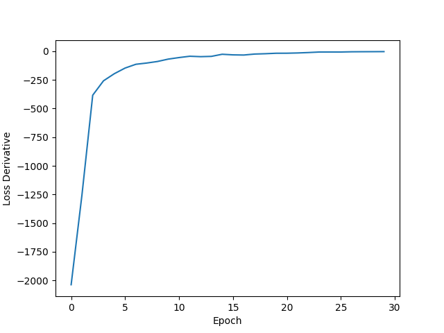
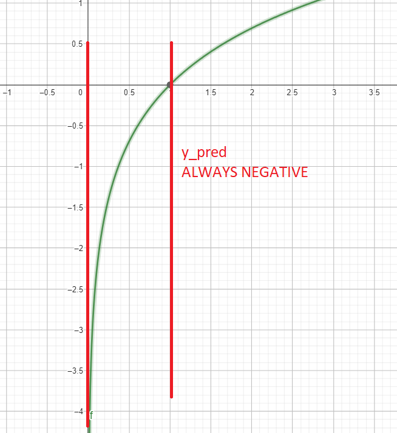
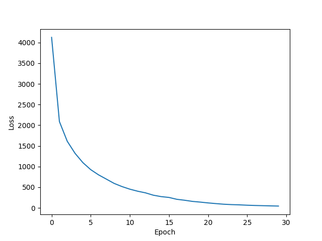

# Neural Network from Scratch: Digit Recognition

This project implements a multi-layer perceptron neural network from scratch in Python to classify handwritten digits from the [MNIST dataset](#MNIST-dataset). The goal is to gain a deeper understanding of the underlying concepts by building the model without using deep learning libraries.

## Table of Contents
1. [Dataset](#Dataset)
    - [MNIST dataset](#MNIST-dataset)
    - [Training Example](#Training-Example)
    - [Preprocessing](#Preprocessing)
2. [Neural Network Architecture](#Neural-Network-Architecture)
    - [Input layer](#Input-layer)
    - [Hidden layers](#Hidden-layers)
    - [Output layer](#Output-layer)
    - [Hiperparameters](#Hiperparameters)
3. [Forward propagation](#Forward-propagation)
    - [Implementation in Python](#Implementation-in-Python)
    - [Explanation](#Explanation)
4. [Loss Function: Cross-entropy](#Loss-Function:-Cross-entropy)
5. [Learning and Optimization: Gradient Descent](#Learning-and-Optimization:-Gradient-Descent)
    - [Implementation](#Implementation)
6. [Real-Time Digit Recognition]()
7. [Comparison with TensorFlow](#Comparison-with-TensorFlow)

##### Screenshots


##### Cross-entropy as loss function
$$J(p,q) = -\sum_{x}p(x)log(q(x))$$
[Why cross-entropy?](#Loss-Function:-Cross-entropy)

##### Gradient descent as optimization algorithm
$$w = w - \alpha \frac{\partial L}{\partial w}$$
$$b = b - \alpha \frac{\partial L}{\partial b}$$
[Why gradient descent?](#Learning-and-Optimization:-Gradient-Descent)

## Dataset
#### MNIST dataset
The [MNIST dataset](https://en.wikipedia.org/wiki/MNIST_database) consists of 70,000 28x28 images of handwritten digits (0-9). Each image is represented as a 784-vector of pixel values ranging from 0 to 255 (28x28=784).

#### Training Example
A training example consists of a 785-vector, where the first value represents the handwritten digit true label (0-9), and the remaining 784 values correspond to the pixel values of the 28x28 image ranging from 0 to 255.

#### Preprocessing
The dataset is normalized as pixel_value / 255 (max value).

## Neural Network Architecture
#### Input layer
- 784 neurons, one for each pixel (28x28).
#### Hidden layers
- Two hidden layers with 25 and 15 neurons respectively.
- Both use [ReLU](https://en.wikipedia.org/wiki/Rectifier_(neural_networks)) activation.
#### Output layer
- 10 neurons, one for each digit.
- [Softmax](https://en.wikipedia.org/wiki/Softmax_function) activation transforms the nn's output into a probability distribution.

ReLU and Softmax implementation in Python:
```python
def relu(x):
    return np.where(x > 0, x, 0)

def softmax(x):
    exp_x = np.exp(x)
    return exp_x / np.sum(exp_x)
```

#### Hiperparameters
- Epochs: 20.
- Learning Rate: Fixed at 0.01. While more advanced algos like [Adam](https://optimization.cbe.cornell.edu/index.php?title=Adam) could be considered, a learning rate of 0.01 achieves an accuracy of approximately 98%, which is sufficient for practical purposes.
- Weight Initialization: [He initialization](https://machinelearningmastery.com/weight-initialization-for-deep-learning-neural-networks/) for weights, and biases are initialized to 0.

#### After 20 epochs, the loss functions doesn't change much...


#### Model implementation in Python:
```python
layers = [784, 25, 15, 10]
model = NN(layers)

# Train
model.fit(
    X_train,
    y_train,
    epochs=30,
    learning_rate=0.01,
    batch_size=1,
)

# Test
y_pred = model.predict(X_test)
y_pred = np.argmax(y_pred, axis=1)
print("Accuracy:", np.mean(y_pred == y_test))
```
[nn_scratch.py]()

## Forward propagation
The `predict(X)` function performs the forward propagation:

#### Implementation in Python:
```python
def predict(X):
    # Input layer
    Z[0] = X

    # Hidden layers
    for i in range(len(layers) - 2):
        Z[i + 1] = relu(np.dot(Z[i], W[i].T) + B[i])

    # Output layer
    Z[-1] = np.dot(Z[-2], W[-1].T) + B[-1]
    y_pred = softmax(Z[-1])

    return y_pred
```

#### Explanation
1. **Input Layer**:
    - Set the input layer as `X`.
2. **Hidden Layers**:
    - For each hidden layer:
        - For each hidden neuron:
            - This neuron relys on all previous layer neurons * its mutual weights: n1w1 + n2w2 + ... + nNwN, and thats literally the definition of dot product: `np.dot(Z[i], W[i].T)`.
            - Add the bias: `+ B[i]`.
            - Apply the activation function: `relu()`.
            - It's done!
3. **Output Layer**:
    - Similar to the hidden layers but without the activation function.
    - Apply the softmax function to get the probabilities of each digit.

## Loss Function: Cross-entropy
Being the generalization of the well-known [log-loss](https://en.wikipedia.org/wiki/Cross_entropy#Cross-entropy_loss_function_and_logistic_regression) function for binary classification, cross-entropy is a natural choice for multi-class classification problem.

For each training example:
- `y_pred` is the output of the NN, a 10-vector containing the probabilities of each digit.
- `y_true` is the true label one hot encoded.

It works as follows:
```python
y_pred = self.predict(X_train[i])
y_true = np.zeros(self.layers[-1])
y_true[y_train[i]] = 1

loss = cross_entropy(y_true, y_pred)
epoch_loss += loss
```
Where `cross_entropy` is defined as:
```python
def cross_entropy(y_true, y_pred):
    return -np.sum(y_true * np.log(y_pred))
```

#### Example
```python
true_label = 3
y_true = [0, 0, 0, 1, 0, 0, 0, 0, 0, 0] # Input one hot encoded
y_pred = [0, 0, 0, 0.7, 0, 0.1, 0, 0, 0.2, 0] # NN softmax output
```
So,
```python
np.log(y_pred) = [0, 0, 0, -0.35, 0, -2.3, 0, 0, -1.6, 0]
y_true * np.log(y_pred) = [0, 0, 0, -0.35, 0, 0, 0, 0, 0, 0]
-np.sum(y_true * np.log(y_pred)) = 0.35
```

ln(y_pred) values will be always negative cos 0 < y_pred < 1



so -np.sum() to positive loss.

#### Loss over epochs


## Learning and Optimization: Gradient Descent
Backpropagation is an algorithm used to train neural networks by iteratively adjusting the weights and biases in the direction that minimizes the loss function. The update rule for the weights and biases is as follows:

$$W_{ij} = W_{ij} - \alpha \frac{\partial L}{\partial W_{ij}}$$

Where:

- $W_{ij}$ represents the weight connecting neuron i in layer l to neuron j in layer l+1. This weight is stored in a weight matrix W.
- `alpha` is the learning rate, which determines the step size of each weight update.
- `dL / dW_ij` stands for the partial derivative of the loss function L with respect to the weight W_ij. It tells us how the loss function changes as we make adjustments to this weight.

We can calculate the partial derivative of the loss function with respect to the weights and biases using the chain rule:

$$\frac{\partial Loss}{\partial W_i} = \frac{\partial Loss}{\partial Z_i} \frac{\partial Z_i}{\partial W_i}$$

$$\frac{\partial Loss}{\partial B_i} = \frac{\partial Loss}{\partial Z_i} \frac{\partial Z_i}{\partial B_i}$$

$W$ is an array of weight matrices where $W[layer][neuron]$. For example, $W[0][784][25]$ denotes the weights from the 784 neurons in layer 0 to the 25 neurons in layer 1.
$Z$ is an array of neuron activations where $Z[layer][neuron]$. For example, $Z[0][784]$ represents the activations in the input layer, and $Z[1][25]$ represents the activations in the first hidden layer.
$B$ is an array of biases, where $B[layer][neuron]$. For example, $B[0][25]$ represents the biases for the 25 neurons in the first hidden layer.

    W[layer][neuron] : (0, 784, 25), (1, 25, 15), (2, 15, 10)
    Z[layer][neuron] : (0, 784), (1, 25), (2, 15), (3, 10)
    B[layer][neuron] : (0, 25), (1, 15), (2, 10)

#### Implementation
Calculating the partial derivatives:

$$\frac{\partial L}{\partial z_{j}} = y_{pred} - y_{true}$$

The explanation here is quite complicated but if you are interested, [this is the sauce](https://towardsdatascience.com/derivative-of-the-softmax-function-and-the-categorical-cross-entropy-loss-ffceefc081d1).

    >.<

#### Backpropagation implementation in Python:
```python
# Output layer
dl_dz[-1] = y_pred - y_true
dl_dw[-1] = np.outer(dl_dz[-1], Z[-2])
dl_db[-1] = dl_dz[-1]

# Hidden layers
for i in range(-2, -len(layers), -1):
    dl_dz[i] = np.dot(W[i + 1].T, dl_dz[i + 1]) * relu_derivative(Z[i])
    dl_dw[i] = np.outer(dl_dz[i], Z[i - 1])
    dl_db[i] = dl_dz[i]

# Update weights and biases
for i in range(len(layers) - 2):
    W[i] -= learning_rate * dl_dw[i] / batch_size
    B[i] -= learning_rate * dl_db[i] / batch_size
```

## Real-Time Digit Recognition
Basic 28x28 canvas to draw whatever you want and the model will have to predict it every second >.<

```python
if frames % FPS == 0 and cells.sum() > 0:
    X = get_X() / 255
    y = model.predict(X)[0]
```    

- `Left-click` to draw.
- `Right-click` to erase.
- `R` to reset the canvas.


[draw_scratch.py](draw_scratch.py)

## Comparison with TensorFlow
The same neural network was implemented using TensorFlow to compare the results. Using the same data.

| Implementation | Accuracy | Time (s) |
| :---: | :---: | :---: |
| Scratch | 0.934 | 28.9791 |
| TensorFlow | 0.94 | 6.2679 |

[nn_tf.py](nn_tf.py)