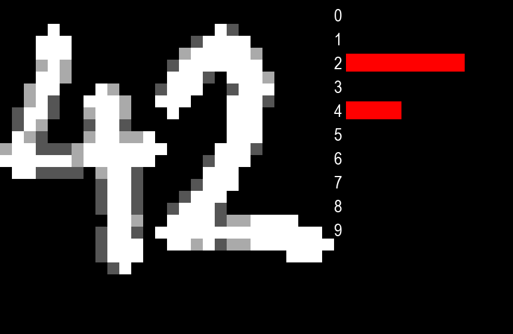

# Neural Network from Scratch: Digit Recognition
A fast and cool MLP from scratch in Python that classifies handwritten digits from the [MNIST dataset](#mnist-dataset).

Video (Spanish): https://www.youtube.com/watch?v=0eb_RSzP3rY

#### UPDATE 7/11/23:
Added parallelization with batches => now trains **x17** faster! :D

#### Screenshots
   

   

  

## Table of Contents
1. [MNIST dataset](#mnist-dataset)
2. [Neural Network Architecture](#neural-network-architecture)
3. [Forward propagation](#forward-propagation)
4. [Loss Function: Cross-entropy](#loss-function-cross-entropy)
5. [Learning and Optimization: Gradient Descent](#learning-and-optimization-gradient-descent)
6. [Real-Time Digit Recognition](#real-time-digit-recognition)
7. [Scratch vs. TensorFlow](#scratch-vs-tensorflow)

#### Cross-entropy loss function
$$J(p,q) = -\sum_{x}p(x)log(q(x))$$
[Why cross-entropy?](#loss-function-cross-entropy)

#### Gradient descent as optimization algorithm
$$w = w - \alpha \frac{\partial L}{\partial w}$$
$$b = b - \alpha \frac{\partial L}{\partial b}$$
[Why gradient descent?](#learning-and-optimization-gradient-descent)

## MNIST dataset
The [MNIST dataset](https://en.wikipedia.org/wiki/MNIST_database) consists of 70,000 images of handwritten digits (0-9) represented as a 784-vector of pixel values (28x28=784) ranging from 0 to 255.

#### Preprocessing
The data is normalized as pixel_value / 255.

## Neural Network Architecture
#### Input layer
- 784 neurons, one for each pixel.
#### Hidden layers
- Two hidden layers with 50 and 25 neurons respectively.
- Both use [ReLU](https://en.wikipedia.org/wiki/Rectifier_(neural_networks)) activation.
#### Output layer
- 10 neurons with linear activation (one for each digit).
- And finally [softmax](https://en.wikipedia.org/wiki/Softmax_function) to get the probabilities of each digit.

#### Parameters
- 784 * 50 + 50 * 25 + 25 * 10 = 40700 weights.
- 50 + 25 + 10 = 85 biases.
- Total: 40785 parameters.

ReLU and Softmax implementation in Python:
```python
def relu(X):
    return np.where(X > 0, X, 0)

def softmax(logits):
    exp_logits = np.exp(logits)
    return exp_logits / np.sum(exp_logits, axis=1, keepdims=True)
```

#### Hiperparameters
- Epochs: 10
- Batch Size: 64
- Learning Rate: Fixed at 0.01. While more advanced algorithms like [Adam](https://optimization.cbe.cornell.edu/index.php?title=Adam) could be considered, a learning rate of 0.01 achieves an accuracy of approximately 98%, which is enough for practical purposes.
- Weight Initialization: [He initialization](https://machinelearningmastery.com/weight-initialization-for-deep-learning-neural-networks/) for weights.

#### After 20 epochs, the loss functions doesn't change much:


#### Model implementation in Python:
```python
layers = [784, 50, 25, 10]
model = NN(layers)

# Train
model.fit(
    X_train,
    y_train,
    epochs=10,
    learning_rate=0.01,
    batch_size=64,
)

# Evaluate
evaluate(model, X_train, y_train, "Train")
evaluate(model, X_val, y_val, "Validation")
```
[nn_scratch.py](nn_scratch.py)

## Forward propagation
The `predict(X)` function performs the forward propagation as follows:

```python
def predict(self, X):
    batch_size = X.shape[0]
    Z = [np.zeros((batch_size, c)) for c in self.layers]

    # Input layer
    Z[0] = X

    # Hidden layers
    for i in range(len(self.layers) - 2):  # 0, 1
        Z[i + 1] = relu(Z[i] @ self.W[i] + self.B[i])

    # Output layer
    Z[3] = Z[2] @ self.W[2] + self.B[2]

    return Z, softmax(Z[3])
```

#### Explanation
1. **Input Layer**:
    - The input layer `Z[0]`  is just the input itself.
2. **Hidden Layers**:
    - For each hidden layer:
        - The neuron activations `Z[n]` are computed in parallel using ReLU = $max$ between $0$ and $W_{n-1} \cdot Z_{n-1} + B_n$ where $n$ is the layer.
3. **Output Layer**:
    - Similar to the hidden layers, but with linear activation instead.
    - And then the 10-vector ouput pass through `softmax()` to get the probabilities of each digit.

## Loss Function: Cross-entropy
Being the generalization of the well-known [log-loss](https://en.wikipedia.org/wiki/Cross_entropy#Cross-entropy_loss_function_and_logistic_regression) function for binary classification, cross-entropy is a natural choice for multi-class classification problem.

For each training example:
- `y_pred` is `softmax(Z[-1])` where `Z[-1]` is the nn's output layer, a 10-vector, softmax just return the probs that sums to 1.
- `y_true` is just the true label one hot encoded, that is for example `[0, 0, 0, 1, 0, 0, 0, 0, 0, 0]` when the true label is `3`.

Implementation:
```python
y_true = np.zeros((batch_size, self.layers[-1]))
y_true[np.arange(batch_size), y_batch] = 1  # label one hot encoded
epoch_loss += cross_entropy(y_true, y_pred) / batch_size
```

Where `cross_entropy()` is defined as follows:
```python
def cross_entropy(y_true, y_pred):
    return -np.sum(y_true * np.log(y_pred + 1e-8))  # 1e-8 to avoid ln(0)
```

`np.log(y_pred)` is always negative cos its input `y_pred` is a probability that ranges from 0 to 1 (as shown in the picture below). Therefore, we multiply it by `-1` to obtain a positive loss. We also add a very small number to avoid `ln(0)`, which is undefined, as there is no number to which you can raise `e` to obtain `0`.


## Learning and Optimization: Gradient Descent
Neural netorks learns by iteratively adjusting it's weights and biases to minimize the loss function. This is done by calculating the partial derivatives of the loss function with respect to the weights and biases, and then updating them in the opposite direction of the gradient.

#### Gradient descent
$$w = w - \alpha \frac{\partial L}{\partial w}$$
$$b = b - \alpha \frac{\partial L}{\partial b}$$

Where $\alpha$ is the learning rate.

#### How much does the loss function change when the weights and biases change?

Using the chain rule:
$$\frac{\partial L}{\partial w} = \frac{\partial L}{\partial z} \frac{\partial z}{\partial w}$$
$$\frac{\partial L}{\partial b} = \frac{\partial L}{\partial z} \frac{\partial z}{\partial b}$$

Where $z$ are the activation functions of the neurons.

#### Implementation in Python:
```python
def backprop(self, Z, y_true, y_pred):
    dZ = [np.zeros_like(z) for z in Z]
    dW = [np.zeros_like(w) for w in self.W]
    dB = [np.zeros_like(b) for b in self.B]

    # Supposing batch_size=64 and layers=[784, 50, 25, 10], then:
    # Z = [(64, 784), (64, 50), (64, 25), (64, 10)]
    # W = [(784, 50), (50, 25), (25, 10)]
    # B = [(50,), (25,), (10,)]

    """
    ∂Loss/∂Z-1 = ∂Loss/∂Softmax * ∂Softmax/∂Z-1
                = (Softmax - Y) * Softmax * (1 - Softmax) where Softmax = y_pred
    ∂Loss/∂W-1 = ∂Loss/∂Z-1 * ∂Z-1/∂W-1
                = ∂Loss/∂Z-1 * Z-2
    ∂Loss/B-1  = ∂Loss/∂Z-1 * ∂Z-1/∂B-1
                = ∂Loss/∂Z-1 * 1 (cos the bias is just added)
    """

    # Output layer
    dZ[-1] = (y_pred - y_true) * y_pred * (1 - y_pred)  # (64, 10)^3 => (64, 10)
    dW[-1] = (dZ[-1].T @ Z[-2]).T  # ((64, 10).T @ (64, 25)).T => (25, 10)
    dB[-1] = np.sum(dZ[-1], axis=0)  # (64, 10) => (10,)

    # Hidden layers
    for i in range(-2, -len(self.layers), -1):  # -2, -3
        dZ[i] = (self.W[i + 1] @ dZ[i + 1].T).T * relu_derivative(Z[i])  # ((25, 10) @ (64, 10).T).T => (64, 25)
        dW[i] = (dZ[i].T @ Z[i - 1]).T  # ((64, 25).T @ (64, 50)).T => (50, 25)
        dB[i] = np.sum(dZ[i], axis=0)  # (64, 25) => (25,)

    return dW, dB
```

## Real-Time Digit Recognition
After training, evaluation, and playing with the hyperparameters to improve the performance, we can save the trained weights and biasses using `save_model()` and load it with `load_model()`.

I have built a pretty-basic 28x28 canvas >.< using [PyGame](https://en.wikipedia.org/wiki/Pygame) to draw and see the predictions of our scratch model in real-time.

[draw_scratch.py](draw_scratch.py)

It does a prediction every second (if the canvas is not empty xD)
```python
if frames % FPS == 0 and cells.sum() > 0:
    X = get_X() / 255 # normalize
    y = model.predict(X)[0]
```

#### Controls:
- `Left-click` to draw.
- `Right-click` to erase.
- `R` to reset the canvas.

#### Example:


## Scratch vs. TensorFlow
Using batch parallelization, the Scratch model outperforms the TensorFlow implementation in time, but accuracy is pretty much the same. The idea of the project was to learn how neural networks work, so I didn't focus on performance >:p
| | nrows | Epochs | Batch | Train | Validation | Time s | $\alpha$ |
| :---: | :---: | :---: | :---: | :---: | :---: | :---: | :---: |
| Scratch | 60K | 10 | 128 | 0.0841 | 0.1345 | 5.1375 | 0.01 |
| TensorFlow | 60K | 10 | 128 | 0.0710 | 0.1556 | 6.7309 | Adam(0.01) |

[nn_scratch.py](https://github.com/kepler296e/nn_scratch_mnist/blob/main/nn_scratch.py)

[nn_tf.py](https://github.com/kepler296e/nn_scratch_mnist/blob/main/nn_tf.py)

That's all, it was such a fun project! bye