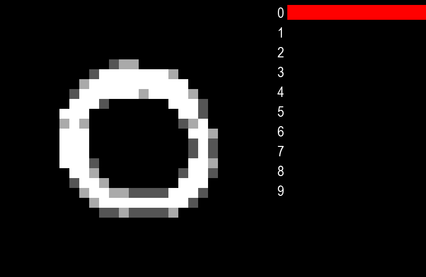
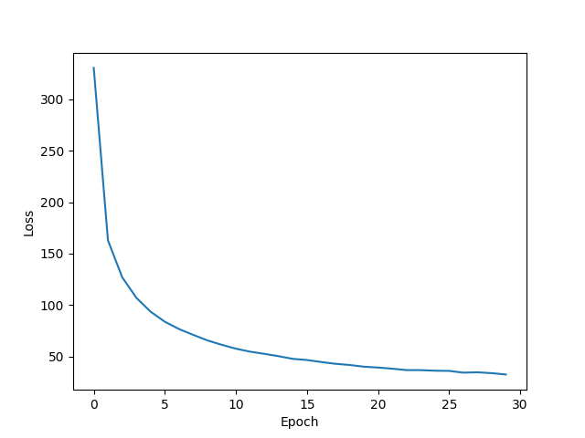

# Neural Network from Scratch: Digit Recognition

This project implements a multi-layer perceptron neural network from scratch in Python to classify handwritten digits from the [MNIST dataset](#MNIST-dataset). The goal is to gain a deeper understanding of the underlying concepts by building the model without using deep learning libraries.

## Table of Contents
1. [Dataset](#Dataset)
2. [Neural Network Architecture](#Neural-Network-Architecture)
3. [Forward propagation](#Forward-propagation)
4. [Loss Function: Cross-entropy](#Loss-Function-Cross-entropy)
5. [Learning and Optimization: Gradient Descent](#Learning-and-Optimization-Gradient-Descent)
6. [Real-Time Digit Recognition](#Real-Time-Digit-Recognition)
7. [Comparison with TensorFlow](#Comparison-with-TensorFlow)

##### Screenshots
   

   

  

##### Cross-entropy as loss function
$$J(p,q) = -\sum_{x}p(x)log(q(x))$$
[Why cross-entropy?](#Loss-Function-Cross-entropy)

##### Gradient descent as optimization algorithm
$$w = w - \alpha \frac{\partial L}{\partial w}$$
$$b = b - \alpha \frac{\partial L}{\partial b}$$
[Why gradient descent?](#Learning-and-Optimization-Gradient-Descent)

## Dataset
#### MNIST dataset
The [MNIST dataset](https://en.wikipedia.org/wiki/MNIST_database) consists of 70,000 images of handwritten digits (0-9). Each image is represented as a 784-vector of pixel values (28x28=784) ranging from 0 to 255.

#### Preprocessing
The dataset is normalized as pixel_value / 255 (max value).

## Neural Network Architecture
#### Input layer
- 784 neurons, one for each pixel.
#### Hidden layers
- Two hidden layers with 25 and 15 neurons respectively.
- Both use [ReLU](https://en.wikipedia.org/wiki/Rectifier_(neural_networks)) activation.
#### Output layer
- 10 neurons, one for each digit.
- [Softmax](https://en.wikipedia.org/wiki/Softmax_function) activation transforms the nn's output into a probability distribution.

ReLU and Softmax implementation in Python:
```python
def relu(x):
    return np.where(x > 0, x, 0)

def softmax(x):
    exp_x = np.exp(x)
    return exp_x / np.sum(exp_x)
```

#### Hiperparameters
- Epochs: 20.
- Learning Rate: Fixed at 0.01. While more advanced algos like [Adam](https://optimization.cbe.cornell.edu/index.php?title=Adam) could be considered, a learning rate of 0.01 achieves an accuracy of approximately 98%, which is sufficient for practical purposes.
- Weight Initialization: [He initialization](https://machinelearningmastery.com/weight-initialization-for-deep-learning-neural-networks/) for weights, and biases are initialized to 0.

#### After 20 epochs, the loss functions doesn't change much...


#### Model implementation in Python:
```python
layers = [784, 25, 15, 10]
model = NN(layers)

# Train
model.fit(
    X_train,
    y_train,
    epochs=30,
    learning_rate=0.01,
    batch_size=1,
)

# Test
y_pred = model.predict(X_test)
y_pred = np.argmax(y_pred, axis=1)
print("Accuracy:", np.mean(y_pred == y_test))
```
[nn_scratch.py](nn_scratch.py)

## Forward propagation
The `predict(X)` function performs the forward propagation:

```python
def predict(X):
    # Input layer
    Z[0] = X

    # Hidden layers
    for i in range(len(layers) - 2):
        Z[i + 1] = relu(np.dot(Z[i], W[i].T) + B[i])

    # Output layer
    Z[-1] = np.dot(Z[-2], W[-1].T) + B[-1]
    y_pred = softmax(Z[-1])

    return y_pred
```

#### Explanation
1. **Input Layer**:
    - Set the input layer as `X`.
2. **Hidden Layers**:
    - For each hidden layer:
        - For each hidden neuron:
            - This neuron relys on all previous layer neurons * its mutual weights: n1w1 + n2w2 + ... + nNwN, and thats literally the definition of dot product: `np.dot(Z[i], W[i].T)`.
            - Add the bias: `+ B[i]`.
            - Apply the activation function: `relu()`.
            - It's done!
3. **Output Layer**:
    - Similar to the hidden layers but with linear activation.
    - Apply the softmax function to get the probabilities of each digit.

## Loss Function: Cross-entropy
Being the generalization of the well-known [log-loss](https://en.wikipedia.org/wiki/Cross_entropy#Cross-entropy_loss_function_and_logistic_regression) function for binary classification, cross-entropy is a natural choice for multi-class classification problem.

For each training example:
- `y_pred` is the output of the nn, a 10-vector containing the probabilities of each digit.
- `y_true` is the true label one hot encoded.

It works as follows:
```python
y_pred = self.predict(X_train[i])
y_true = np.zeros(self.layers[-1])
y_true[y_train[i]] = 1 # One hot encoded true label

loss = cross_entropy(y_true, y_pred)
epoch_loss += loss
```
Where `cross_entropy` is defined as:
```python
def cross_entropy(y_true, y_pred):
    return -np.sum(y_true * np.log(y_pred))
```

`np.log(y_pred)` values will be always negative cos `0 < y_pred < 1`.


so `np.sum()` must be `*-1` to get a positive value.

#### Loss function over epochs


## Learning and Optimization: Gradient Descent
Neural netorks learns by iteratively adjusting the weights and biases to minimize the loss function. This is done by calculating the partial derivatives of the loss function with respect to the weights and biases, and then updating the weights and biases in the opposite direction of the gradient.

#### Gradient descent
$$w = w - \alpha \frac{\partial L}{\partial w}$$
$$b = b - \alpha \frac{\partial L}{\partial b}$$

Where $\alpha$ is the learning rate.

#### How much do the loss function changes when we change the weights and biases?

Using the chain rule:
$$\frac{\partial L}{\partial w} = \frac{\partial L}{\partial z} \frac{\partial z}{\partial w}$$
$$\frac{\partial L}{\partial b} = \frac{\partial L}{\partial z} \frac{\partial z}{\partial b}$$

Where $z$ is the output of a neuron.

#### Implementation in Python:
```python
# Output layer
dl_dz[-1] = y_pred - y_true
dl_dw[-1] = np.outer(dl_dz[-1], Z[-2])
dl_db[-1] = dl_dz[-1]

# Hidden layers
for i in range(-2, -len(layers), -1):
    dl_dz[i] = np.dot(W[i + 1].T, dl_dz[i + 1]) * relu_derivative(Z[i])
    dl_dw[i] = np.outer(dl_dz[i], Z[i - 1])
    dl_db[i] = dl_dz[i]

# Update weights and biases
for i in range(len(layers) - 2):
    W[i] -= learning_rate * dl_dw[i] / batch_size
    B[i] -= learning_rate * dl_db[i] / batch_size
```

## Real-Time Digit Recognition
After saving the model weights and biases as [scratch_model.npy](scratch_model.npy), we can import [nn_scratch.py](nn_scratch.py) and use it's `predict()` function.

I build a basic 28x28 canvas using [pygame](https://en.wikipedia.org/wiki/Pygame) to predict whatever you draw as a 28x28 0 to 255 pixel values vector.

```python
if frames % FPS == 0 and cells.sum() > 0:
    X = get_X() / 255
    y = model.predict(X)[0]
```    

#### Controls:
- `Left-click` to draw.
- `Right-click` to erase.
- `R` to reset the canvas.

#### Screenshot:


[draw_scratch.py](draw_scratch.py)

#### Comparison with TensorFlow
| | Accuracy | Time (s) | $\alpha$ | Script |
| :---: | :---: | :---: | :---: | :---: |
| Scratch | 0.934 | 28.9791 | 0.01 | [nn_scratch.py](https://github.com/kepler296e/nn_scratch_mnist/blob/main/nn_scratch.py) |
| TensorFlow | 0.94 | 6.2679 | Adam(0.001) | [nn_tf.py](https://github.com/kepler296e/nn_scratch_mnist/blob/main/nn_tf.py) |

Over 30 epochs on 5000 training examples and 1000 test examples.